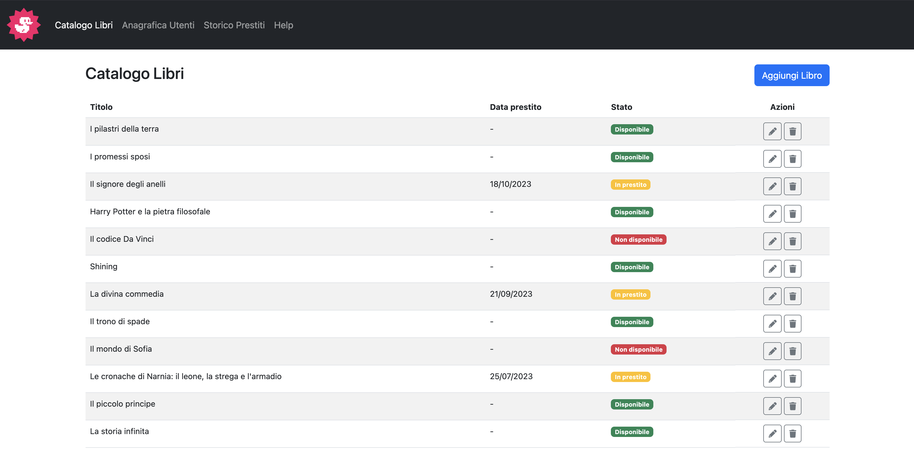
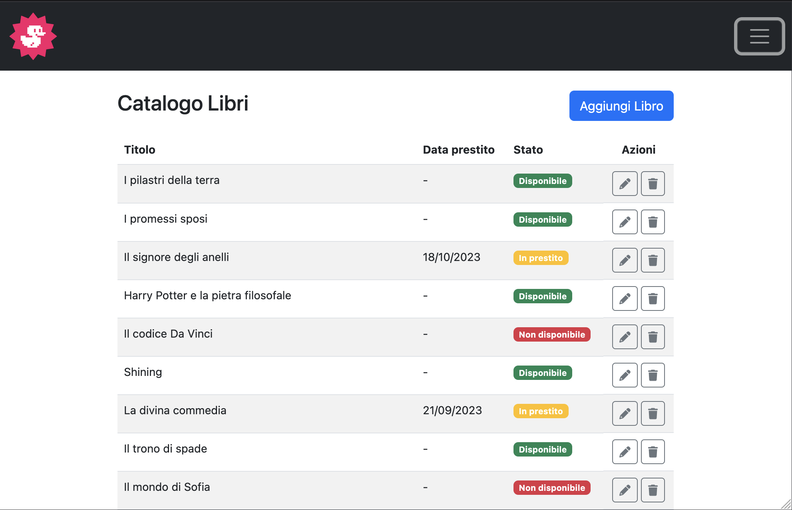
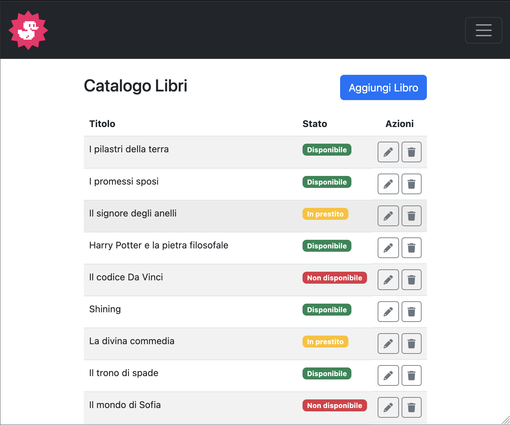
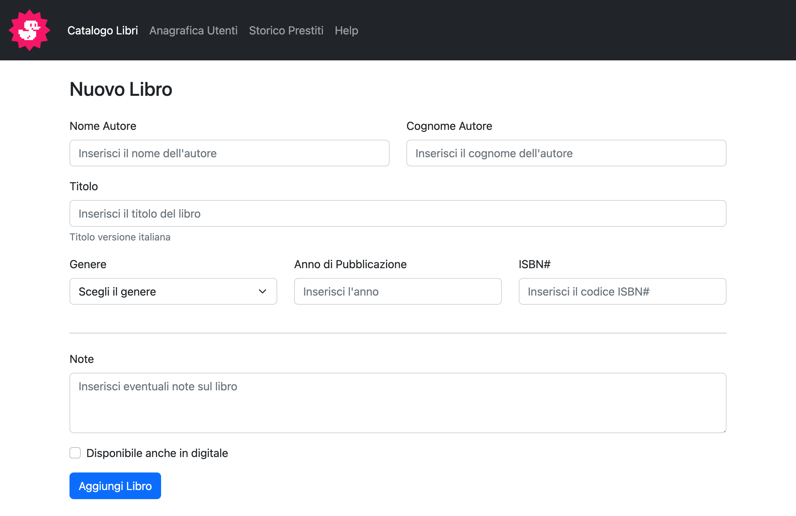
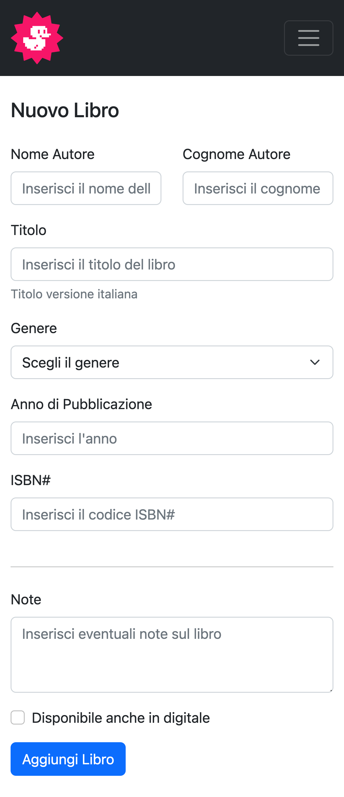

# html-css-bootstrap-dashboard

## 🇬🇧 English Version

### # Overview

Exercise focused on recreating a responsive dashboard layout using Bootstrap 5.  
The project is divided into two parts: the main dashboard layout and a second page containing a form built with Bootstrap components.

---

## # Part 1 — Dashboard Layout

### # Assignment Summary

The exercise required to:

- Create the folder/repository `html-css-bootstrap-dashboard`
- Rebuild the dashboard layout following the provided screenshots
- Use Bootstrap 5 for the entire structure (grid, components, helpers and utilities)
- Rely on official documentation to correctly apply layout rules and responsive behaviour
- Test Bootstrap components in a separate file before integrating them into the project
- Keep custom CSS minimal by leveraging Bootstrap classes

---

### Desktop

### Tablet

### Mobile

---

## # Part 2 — New Page With Form

### # Assignment Summary

The second part required to:

- Continue working inside the same repository (`html-css-bootstrap-dashboard`)
- Add a new page to the dashboard containing a form
- Use HTML form tags together with Bootstrap 5 classes to style inputs, selects, checkboxes, layout blocks and spacing
- Apply the Bootstrap grid system to position form elements correctly on desktop and mobile
- Use spacing utilities (m-_, p-_) for padding and margins
- Keep Bootstrap documentation close at hand while working (components, forms, helpers, layout)
- Test each Bootstrap form component separately before integrating it into the final layout

---

### Desktop (new form page)

### Mobile (new form page)

---

---

## 🇮🇹 Versione Italiana

### # Panoramica

Esercizio dedicato alla riproduzione di una dashboard responsive utilizzando Bootstrap 5.  
Il progetto è suddiviso in due parti: layout principale della dashboard e una seconda pagina con un form completo.

---

## # Parte 1 — Layout Dashboard

### # Riassunto della Consegna

La consegna richiedeva di:

- Creare la cartella/repo `html-css-bootstrap-dashboard`
- Ricostruire il layout della dashboard seguendo gli screenshot allegati
- Utilizzare Bootstrap 5 per griglia, componenti, helper e utilities
- Tenere sempre sotto mano la documentazione ufficiale
- Testare i componenti Bootstrap in un file separato prima di integrarli
- Ridurre al minimo il CSS personalizzato sfruttando le classi predefinite

---

### Desktop

### Tablet

### Mobile

---

## # Parte 2 — Nuova Pagina con Form

### # Riassunto della Consegna

La seconda parte richiedeva di:

- Continuare a lavorare nella stessa repository (`html-css-bootstrap-dashboard`)
- Aggiungere una nuova pagina con un form completo
- Utilizzare i tag form HTML combinati con le classi Bootstrap 5
- Usare il sistema a griglia di Bootstrap per disporre correttamente i campi su desktop e mobile
- Utilizzare utilities di spacing (m-_, p-_) per le spaziature
- Rivedere componenti, helper e utilities nella documentazione
- Provare i componenti Bootstrap in un file separato prima di integrarli nel layout finale

---

### Desktop (nuova pagina)

### Mobile (nuova pagina)

